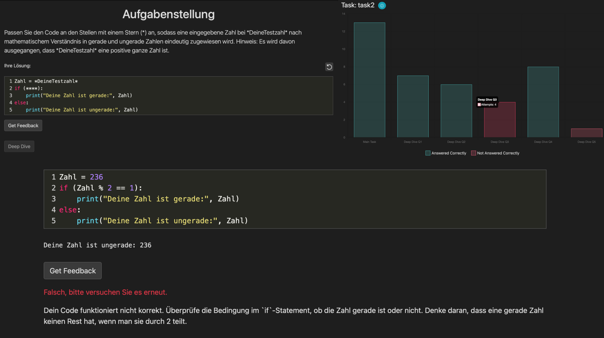

# E-Learning and Assessment Web Application

## Project Overview
This project was developed as part of a Group Project during the **"E-Assessment & Learning Analytics"** course at **Ludwig Maximilian University of Munich (LMU)** in the **Summer Semester of 2024**. The goal of this project is to build an interactive **e-learning and assessment web application** that facilitates learning basic coding principles.

## Features

- **Task-based coding exercises**: Users are given coding challenges to complete.
- **Real-time feedback**: Instant evaluation of coding solutions using OpenAI's API.
- **Deep dive questions**: Follow-up questions to enhance learning.
- **Learning analytics**: Visual representation of progress and performance.

## Image



## Tech Stack

### Frontend

- **HTML5**: Page structure.
- **CSS3**: Styling (layout, colors, fonts).
- **JavaScript**: Interactive elements.
- **Bootstrap**: Responsive UI components.
- **CodeMirror**: JavaScript-based code editor.

### Backend

- **Python**: Backend development.
- **Flask**: Web framework for handling requests.
- **Jinja2**: Template rendering engine.
- **OpenAI API**: Used for generating feedback on user submissions.

### Data Storage

- **JSON**: Storing user data and task results.

### Visualization

- **Chart.js**: Interactive data visualization.

### Development Tools

- **virtualenv**: Isolated environment management.
- **pip**: Dependency installation.

## Important Files

- `app.py`: Main application script handling routes, API calls, and user interactions. Ensure the OpenAI API key is configured here.
- `deepdive.py`: Manages deep dive questions to assess user understanding.
- `LA_manager.py`: Handles learning analytics and performance tracking.
- `tasks.py`: Manages coding tasks and challenge assignments.
- `templates/`: Contains HTML templates for rendering the UI.
- `static/`: Stores static assets such as CSS, JavaScript, and images.
- `requirements.txt`: Lists required dependencies for the application.

## Setup Instructions

### Prerequisites

- **Python 3.6+**
- **Virtualenv**
- **OpenAI API Key** (required for real-time feedback)

### Cloning the Repository

```bash
git clone <https://gitlab.lrz.de/cristian.gavriliu/e-assessment.git>
cd <repository-directory>
```

### Setting Up the Virtual Environment

1. **Create a virtual environment:**

```bash
python3 -m venv venv
```

2. **Activate the virtual environment:**

   - **Windows:**

   ```bash
   venv\Scripts\activate
   ```

   - **macOS/Linux:**

   ```bash
   source venv/bin/activate
   ```

3. **Install required packages:**

```bash
pip install -r requirements.txt
```

4. **Freeze dependencies (for development use only):**

```bash
pip freeze > requirements.txt
```

### Configuring the OpenAI API Key
To enable real-time feedback, update the **API key** in `app.py` where necessary.

## Running the Application

```bash
python app.py
```


## Team Members

| Member     | Current Position |
| ------ | ------ |
| Nina Mandl  | LMU, M.Sc. HCI |
| Cristian Gavriliu  | LMU, M.Sc. HCI |
| Leon Osku | LMU, M.Sc. HCI  |
| Mert Türkekul | LMU, M.Sc. HCI |


## License

This project is for **personal use only** and is intended as a reference point for the projects I have completed during my studies.
